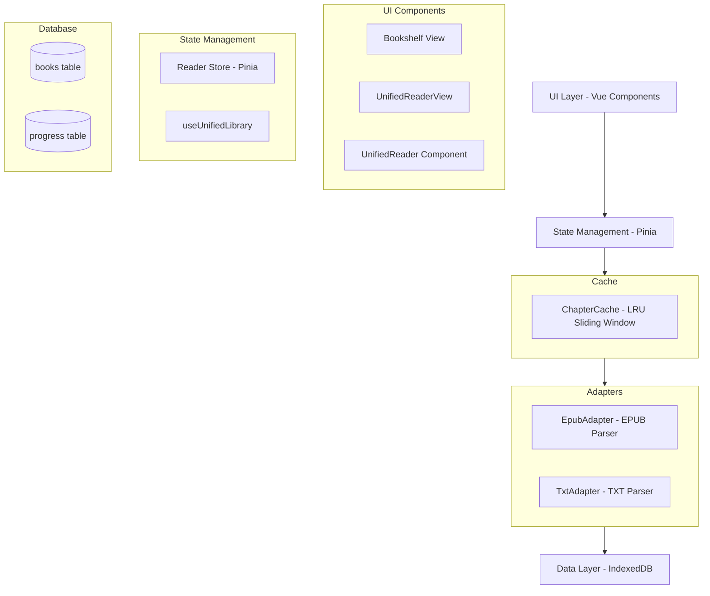

# Design Document: Local Reading Module

## Overview

The Local Reading Module is a pure frontend electronic book management and reading system built with Vue 3, TypeScript, and Vite. It enables users to import, store, and read EPUB and TXT format books entirely within their browser using IndexedDB for persistent storage. The system operates completely offline without any backend dependencies, providing a seamless reading experience with automatic progress tracking and customizable reading preferences.

The architecture follows Vue 3's Composition API patterns with clear separation between data persistence (IndexedDB), business logic (adapters and composables), state management (Pinia), and presentation (Vue components). The system uses a **ContentLayer architecture** for optimal memory efficiency, where text between images is merged into single layers, reducing object instantiation by 90%+ while preserving text formatting through CSS.

## Architecture

### High-Level Architecture



### Layer Responsibilities

**UI Layer (Vue Components)**
- Bookshelf: Display book grid, handle import/delete interactions
- UnifiedReaderView: Container for reader, handles book loading
- UnifiedReader: Renders ContentLayers with navigation controls
- Settings: Reading preference controls (integrated in UnifiedReader)

**State Management Layer (Pinia)**
- ReaderStore: Manages active book, current chapter, reading preferences
- useUnifiedLibrary: Composable for book import, storage, retrieval, deletion
- useProgress: Composable for reading position tracking

**Adapter Layer**
- EpubAdapter: Converts EPUB files to UnifiedBook with ContentLayers
- TxtAdapter: Converts TXT files to UnifiedBook with ContentLayers
- Lazy loading: Only parses chapters on demand

**Cache Layer**
- ChapterCache: LRU sliding window cache (current + prev 1 + next 2 chapters)
- Automatic cleanup of distant chapters
- Prefetching using requestIdleCallback

**Data Layer (IndexedDB)**
- Direct IndexedDB operations (no Dexie.js)
- CRUD operations for books and progress
- Blob storage for covers and book data

## Components and Interfaces

### Database Layer (Direct IndexedDB)

```typescript
// db/index.ts
const DB_NAME = 'LibraryDatabase';
const DB_VERSION = 1;

interface Book {
  id?: number;
  title: string;
  author: string;
  format: 'epub' | 'txt';
  cover: Blob | null;
  data: ArrayBuffer;
  addTime: number;
}

interface Progress {
  id?: number;
  bookId: number;
  chapterId: number;
  layerIndex: number;
  scrollOffset: number;
  updateTime: number;
}

// Direct IndexedDB operations
async function openDB(): Promise<IDBDatabase> {
  return new Promise((resolve, reject) => {
    const request = indexedDB.open(DB_NAME, DB_VERSION);
    
    request.onerror = () => reject(request.error);
    request.onsuccess = () => resolve(request.result);
    
    request.onupgradeneeded = (event) => {
      const db = (event.target as IDBOpenDBRequest).result;
      
      if (!db.objectStoreNames.contains('books')) {
        const bookStore = db.createObjectStore('books', { 
          keyPath: 'id', 
          autoIncrement: true 
        });
        bookStore.createIndex('format', 'format', { unique: false });
        bookStore.createIndex('addTime', 'addTime', { unique: false });
      }
      
      if (!db.objectStoreNames.contains('progress')) {
        const progressStore = db.createObjectStore('progress', { 
          keyPath: 'id', 
          autoIncrement: true 
        });
        progressStore.createIndex('bookId', 'bookId', { unique: false });
      }
    };
  });
}
```

### Adapter: TxtAdapter

```typescript
// adapters/TxtAdapter.ts
export class TxtAdapter {
  // Maximum characters per ContentLayer to prevent DOM performance issues
  private static readonly MAX_LAYER_LENGTH = 15000;

  /**
   * Parse TXT file to UnifiedBook
   */
  static async parse(
    arrayBuffer: ArrayBuffer,
    filename: string
  ): Promise<UnifiedBook> {
    // Try multiple encodings
    let text: string;
    try {
      const decoder = new TextDecoder('utf-8', { fatal: true });
      text = decoder.decode(arrayBuffer);
    } catch (e) {
      try {
        const decoder = new TextDecoder('gbk');
        text = decoder.decode(arrayBuffer);
      } catch (e2) {
        const decoder = new TextDecoder('utf-8', { fatal: false });
        text = decoder.decode(arrayBuffer);
      }
    }

    // Detect chapters using regex
    const CHAPTER_REGEX = /第[一二三四五六七八九十百千0-9]+[章回节].*/g;
    const lines = text.split('\n');
    const chapters: UnifiedChapter[] = [];
    
    let currentChapterStart = 0;
    lines.forEach((line, index) => {
      if (CHAPTER_REGEX.test(line)) {
        if (chapters.length > 0) {
          // Save previous chapter content with chunking
          const prevChapter = chapters[chapters.length - 1];
          const chapterText = lines
            .slice(currentChapterStart, index)
            .join('\n');
          prevChapter.layers = this.chunkText(chapterText);
        }
        
        chapters.push({
          id: chapters.length,
          title: line.trim(),
          layers: [],
          isLoaded: false
        });
        currentChapterStart = index;
      }
    });

    // Handle last chapter or single chapter
    if (chapters.length === 0) {
      chapters.push({
        id: 0,
        title: 'Full Text',
        layers: this.chunkText(text),
        isLoaded: true
      });
    } else {
      const lastChapter = chapters[chapters.length - 1];
      const chapterText = lines.slice(currentChapterStart).join('\n');
      lastChapter.layers = this.chunkText(chapterText);
      lastChapter.isLoaded = true;
    }

    return {
      title: filename.replace(/\.txt$/i, ''),
      author: 'Unknown',
      cover: null,
      format: 'txt',
      chapters,
      rawData: arrayBuffer,
      addTime: Date.now()
    };
  }

  /**
   * Chunk long text into multiple ContentLayers
   * Prevents DOM performance issues with extremely long text
   * Splits at newlines to avoid breaking sentences
   */
  private static chunkText(text: string): ContentLayer[] {
    if (text.length <= this.MAX_LAYER_LENGTH) {
      return [{ text }];
    }

    const layers: ContentLayer[] = [];
    let remainingText = text;

    while (remainingText.length > 0) {
      if (remainingText.length <= this.MAX_LAYER_LENGTH) {
        // Last chunk
        layers.push({ text: remainingText });
        break;
      }

      // Find the nearest newline before the threshold
      let splitIndex = this.MAX_LAYER_LENGTH;
      const searchStart = Math.max(0, this.MAX_LAYER_LENGTH - 500); // Search within 500 chars before threshold
      const lastNewline = remainingText.lastIndexOf('\n', this.MAX_LAYER_LENGTH);

      if (lastNewline > searchStart) {
        // Found a good newline position
        splitIndex = lastNewline + 1; // Include the newline in current chunk
      } else {
        // No newline found, look for space
        const lastSpace = remainingText.lastIndexOf(' ', this.MAX_LAYER_LENGTH);
        if (lastSpace > searchStart) {
          splitIndex = lastSpace + 1;
        }
        // Otherwise use hard limit at MAX_LAYER_LENGTH
      }

      // Create chunk
      const chunk = remainingText.substring(0, splitIndex);
      layers.push({ text: chunk });

      // Continue with remaining text
      remainingText = remainingText.substring(splitIndex);
    }

    return layers;
  }

  /**
   * Lazy load chapter (for TXT, already loaded during parse)
   */
  static async loadChapter(
    book: UnifiedBook,
    chapterId: number
  ): Promise<ContentLayer[]> {
    const chapter = book.chapters[chapterId];
    if (!chapter) {
      throw new Error(`Chapter ${chapterId} does not exist`);
    }
    return chapter.layers;
  }
}
```

### Adapter: EpubAdapter

```typescript
// adapters/EpubAdapter.ts
import ePub from 'epubjs';
import type { Book } from 'epubjs';

export class EpubAdapter {
  // Maximum characters per ContentLayer to prevent DOM performance issues
  private static readonly MAX_LAYER_LENGTH = 15000;

  /**
   * Parse EPUB file to UnifiedBook
   */
  static async parse(
    arrayBuffer: ArrayBuffer,
    filename: string
  ): Promise<UnifiedBook> {
    const epubBook: Book = ePub(arrayBuffer);
    await epubBook.ready;

    // Extract metadata
    const metadata = await epubBook.loaded.metadata;
    const title = metadata.title || filename.replace(/\.epub$/i, '');
    const author = metadata.creator || 'Unknown';

    // Extract cover
    const cover = await this.extractCover(epubBook);

    // Extract chapter structure (lazy loading, no content parsing)
    const chapters = await this.extractChapters(epubBook);

    return {
      title,
      author,
      cover,
      format: 'epub',
      chapters,
      rawData: arrayBuffer,
      addTime: Date.now()
    };
  }

  /**
   * Extract cover
   */
  private static async extractCover(epubBook: Book): Promise<Blob | null> {
    try {
      const coverUrl = await epubBook.coverUrl();
      if (!coverUrl) return null;

      const response = await fetch(coverUrl);
      const blob = await response.blob();
      return blob;
    } catch (error) {
      console.warn('[EpubAdapter] Cover extraction failed:', error);
      return null;
    }
  }

  /**
   * Extract chapter structure (table of contents only)
   */
  private static async extractChapters(epubBook: Book): Promise<UnifiedChapter[]> {
    const navigation = await epubBook.loaded.navigation;
    const toc = navigation.toc;

    const chapters: UnifiedChapter[] = [];

    for (let i = 0; i < toc.length; i++) {
      const item = toc[i];
      chapters.push({
        id: i,
        title: item.label,
        layers: [],
        isLoaded: false
      });
    }

    // If no TOC, use spine
    if (chapters.length === 0) {
      const spine = epubBook.spine;
      for (let i = 0; i < spine.length; i++) {
        chapters.push({
          id: i,
          title: `Chapter ${i + 1}`,
          layers: [],
          isLoaded: false
        });
      }
    }

    return chapters;
  }

  /**
   * Lazy load: Parse specified chapter content
   * Convert XHTML to ContentLayer array
   * Core: Merge text between two images into one layer
   */
  static async loadChapter(
    book: UnifiedBook,
    chapterId: number
  ): Promise<ContentLayer[]> {
    const chapter = book.chapters[chapterId];
    if (!chapter) {
      throw new Error(`Chapter ${chapterId} does not exist`);
    }

    // If already loaded, return directly
    if (chapter.isLoaded && chapter.layers.length > 0) {
      return chapter.layers;
    }

    // Reopen EPUB
    const epubBook: Book = ePub(book.rawData);
    await epubBook.ready;

    // Get chapter content
    const navigation = await epubBook.loaded.navigation;
    const toc = navigation.toc;
    
    let href: string;
    if (toc[chapterId]) {
      href = toc[chapterId].href;
    } else {
      href = epubBook.spine.get(chapterId).href;
    }

    // Load chapter XHTML content
    const section = epubBook.spine.get(href);
    await section.load(epubBook.load.bind(epubBook));
    
    const document = section.document;
    if (!document) {
      throw new Error('Unable to load chapter content');
    }

    // Parse HTML to ContentLayer
    const layers = await this.parseHTML(document, epubBook);

    return layers;
  }

  /**
   * Parse HTML document to ContentLayer array
   * Core algorithm: Truncate when encountering image, generate new layer
   */
  private static async parseHTML(
    document: Document,
    epubBook: Book
  ): Promise<ContentLayer[]> {
    const layers: ContentLayer[] = [];
    const body = document.body;

    if (!body) return layers;

    // Current accumulated text paragraphs
    let currentText: string[] = [];

    // Recursively traverse DOM tree
    await this.traverseDOM(body, layers, currentText, epubBook);

    // Handle remaining text with chunking
    if (currentText.length > 0) {
      const text = currentText.join('\n');
      this.addTextWithChunking(layers, text);
    }

    return layers;
  }

  /**
   * Add text to layers with automatic chunking
   * Splits long text into multiple layers to prevent DOM performance issues
   */
  private static addTextWithChunking(
    layers: ContentLayer[],
    text: string,
    image?: string
  ): void {
    if (text.length <= this.MAX_LAYER_LENGTH) {
      // Text is within limit, add as single layer
      layers.push({ text, image });
      return;
    }

    // Text exceeds limit, need to chunk
    let remainingText = text;
    let isFirstChunk = true;

    while (remainingText.length > 0) {
      if (remainingText.length <= this.MAX_LAYER_LENGTH) {
        // Last chunk - attach image if this is the first chunk
        layers.push({ 
          text: remainingText, 
          image: isFirstChunk ? image : undefined 
        });
        break;
      }

      // Find the nearest newline before the threshold
      let splitIndex = this.MAX_LAYER_LENGTH;
      const searchStart = Math.max(0, this.MAX_LAYER_LENGTH - 500);
      const lastNewline = remainingText.lastIndexOf('\n', this.MAX_LAYER_LENGTH);

      if (lastNewline > searchStart) {
        splitIndex = lastNewline + 1;
      } else {
        const lastSpace = remainingText.lastIndexOf(' ', this.MAX_LAYER_LENGTH);
        if (lastSpace > searchStart) {
          splitIndex = lastSpace + 1;
        }
      }

      // Create chunk - attach image only to first chunk
      const chunk = remainingText.substring(0, splitIndex);
      layers.push({ 
        text: chunk, 
        image: isFirstChunk ? image : undefined 
      });

      isFirstChunk = false;
      remainingText = remainingText.substring(splitIndex);
    }
  }

  /**
   * Recursively traverse DOM nodes
   * Core: Truncate text when encountering image, generate new layer
   */
  private static async traverseDOM(
    element: Element,
    layers: ContentLayer[],
    currentText: string[],
    epubBook: Book
  ): Promise<void> {
    for (const child of Array.from(element.children)) {
      const tagName = child.tagName.toLowerCase();

      // Handle paragraph - convert to string with newline
      if (tagName === 'p') {
        const text = child.textContent?.trim();
        if (text) {
          currentText.push(text);
        }
      }
      // Handle heading - also treat as paragraph
      else if (/^h[1-6]$/.test(tagName)) {
        const text = child.textContent?.trim();
        if (text) {
          currentText.push(text);
        }
      }
      // Handle image - truncate current text, generate new layer
      else if (tagName === 'img') {
        const src = child.getAttribute('src');
        if (src) {
          try {
            const imageUrl = epubBook.resolve(src);
            const response = await fetch(imageUrl);
            const blob = await response.blob();
            const blobUrl = URL.createObjectURL(blob);

            // Truncate: Generate layer(s) with current accumulated text
            if (currentText.length > 0) {
              const text = currentText.join('\n');
              this.addTextWithChunking(layers, text, blobUrl);
              currentText = [];
            } else {
              // If no text, create image-only layer
              layers.push({
                text: '',
                image: blobUrl
              });
            }
          } catch (error) {
            console.error('[EpubAdapter] Image loading failed:', src, error);
          }
        }
      }
      // Recursively handle other container elements
      else if (child.children.length > 0) {
        await this.traverseDOM(child, layers, currentText, epubBook);
      }
      // Handle pure text nodes
      else {
        const text = child.textContent?.trim();
        if (text) {
          currentText.push(text);
        }
      }
    }
  }
}
```

### Component: Bookshelf View

```vue
<!-- views/Bookshelf.vue -->
<template>
  <div class="bookshelf">
    <div class="import-area" @drop.prevent="handleDrop" @dragover.prevent>
      <el-button @click="selectFile">
        <el-icon><Upload /></el-icon>
        Import Book
      </el-button>
      <input
        ref="fileInput"
        type="file"
        accept=".epub,.txt"
        style="display: none"
        @change="handleFileSelect"
      />
    </div>

    <div class="book-grid">
      <div v-for="book in books" :key="book.id" class="book-card">
        <div class="book-cover" @click="openBook(book.id)">
          
          <div v-else class="default-cover">{{ book.title[0] }}</div>
        </div>
        <div class="book-info">
          <h3>{{ book.title }}</h3>
          <p>{{ book.author }}</p>
          <el-progress :percentage="getProgress(book.id)" />
        </div>
        <el-button type="danger" size="small" @click="confirmDelete(book.id)">
          Delete
        </el-button>
      </div>
    </div>
  </div>
</template>

<script setup lang="ts">
import { ref, onMounted } from 'vue';
import { useLibrary } from '@/composables/useLibrary';
import { useProgress } from '@/composables/useProgress';
import { ElMessage, ElMessageBox } from 'element-plus';

const { books, loadBooks, importBook, deleteBook } = useLibrary();
const { getProgressPercentage } = useProgress();
const fileInput = ref<HTMLInputElement | null>(null);
const progressMap = ref<Map<number, number>>(new Map());
const coverUrlCache = ref<Map<number, string>>(new Map());

function getCoverUrl(coverBlob: Blob): string {
  // Create object URL from Blob for efficient display
  return URL.createObjectURL(coverBlob);
}

async function handleDrop(event: DragEvent): Promise<void> {
  const files = event.dataTransfer?.files;
  if (files && files.length > 0) {
    await processFile(files[0]);
  }
}

function selectFile(): void {
  fileInput.value?.click();
}

async function handleFileSelect(event: Event): Promise<void> {
  const target = event.target as HTMLInputElement;
  if (target.files && target.files.length > 0) {
    await processFile(target.files[0]);
  }
}

async function processFile(file: File): Promise<void> {
  const result = await importBook(file);
  if (result.success) {
    ElMessage.success('Book imported successfully');
  } else {
    ElMessage.error(result.error || 'Import failed');
  }
}

async function confirmDelete(bookId: number): Promise<void> {
  await ElMessageBox.confirm('Delete this book?', 'Warning', {
    confirmButtonText: 'Delete',
    cancelButtonText: 'Cancel',
    type: 'warning'
  });
  await deleteBook(bookId);
  ElMessage.success('Book deleted');
}

function getProgress(bookId: number): number {
  return progressMap.value.get(bookId) || 0;
}

async function loadAllProgress(): Promise<void> {
  for (const book of books.value) {
    const progress = await getProgressPercentage(book.id!);
    progressMap.value.set(book.id!, progress);
  }
}

onMounted(async () => {
  await loadBooks();
  await loadAllProgress();
});
</script>
```

### Component: EPUB Reader

```vue
<!-- components/EpubReader.vue -->
<template>
  <div class="epub-reader">
    <div class="reader-toolbar">
      <el-button @click="prevPage">Previous</el-button>
      <el-button @click="showToc">Contents</el-button>
      <el-button @click="nextPage">Next</el-button>
    </div>
    
    <div ref="readerContainer" class="reader-container" :style="readerStyle"></div>
    
    <el-drawer v-model="tocVisible" title="Table of Contents">
      <div v-for="(item, index) in toc" :key="index" @click="goToChapter(item.href)">
        {{ item.label }}
      </div>
    </el-drawer>
  </div>
</template>

<script setup lang="ts">
import { ref, onMounted, onUnmounted, computed } from 'vue';
import ePub, { Book, Rendition } from 'epubjs';
import { useProgress } from '@/composables/useProgress';
import { usePreferences } from '@/composables/usePreferences';

const props = defineProps<{
  bookId: number;
  bookData: ArrayBuffer;
}>();

const readerContainer = ref<HTMLElement | null>(null);
const book = ref<Book | null>(null);
const rendition = ref<Rendition | null>(null);
const toc = ref<any[]>([]);
const tocVisible = ref(false);

const { loadProgress, saveProgress } = useProgress();
const { preferences, getBackgroundColorStyle } = usePreferences();

const readerStyle = computed(() => ({
  backgroundColor: getBackgroundColorStyle(),
  fontSize: `${preferences.value.fontSize}px`,
  lineHeight: preferences.value.lineHeight
}));

async function initReader(): Promise<void> {
  if (!readerContainer.value) return;

  book.value = ePub(props.bookData);
  rendition.value = book.value.renderTo(readerContainer.value, {
    width: '100%',
    height: '100%',
    spread: 'none'
  });

  // Load TOC
  const navigation = await book.value.loaded.navigation;
  toc.value = navigation.toc;

  // Load saved progress
  const progress = await loadProgress(props.bookId);
  if (progress && progress.position) {
    await rendition.value.display(progress.position as string);
  } else {
    await rendition.value.display();
  }

  // Track location changes
  rendition.value.on('relocated', async (location: any) => {
    const cfi = location.start.cfi;
    await saveProgress(props.bookId, 0, cfi);
  });
}

async function nextPage(): Promise<void> {
  await rendition.value?.next();
}

async function prevPage(): Promise<void> {
  await rendition.value?.prev();
}

function showToc(): void {
  tocVisible.value = true;
}

async function goToChapter(href: string): Promise<void> {
  await rendition.value?.display(href);
  tocVisible.value = false;
}

onMounted(initReader);

onUnmounted(() => {
  rendition.value?.destroy();
});
</script>
```

### Component: TXT Reader

```vue
<!-- components/TxtReader.vue -->
<template>
  <div class="txt-reader">
    <div class="reader-toolbar">
      <el-button @click="prevChapter">Previous Chapter</el-button>
      <el-select v-model="currentChapterIndex" @change="goToChapter">
        <el-option
          v-for="(chapter, index) in chapters"
          :key="index"
          :label="chapter.title"
          :value="index"
        />
      </el-select>
      <el-button @click="nextChapter">Next Chapter</el-button>
    </div>

    <div
      ref="scrollContainer"
      class="scroll-container"
      :style="readerStyle"
      @scroll="handleScroll"
    >
      <div :style="{ height: `${totalHeight}px` }">
        <div
          v-for="line in visibleLines"
          :key="line.index"
          :style="{ transform: `translateY(${line.offset}px)` }"
          class="text-line"
        >
          {{ line.content }}
        </div>
      </div>
    </div>
  </div>
</template>

<script setup lang="ts">
import { ref, onMounted, computed } from 'vue';
import { useProgress } from '@/composables/useProgress';
import { usePreferences } from '@/composables/usePreferences';

interface Chapter {
  title: string;
  startLine: number;
  endLine: number;
}

interface Line {
  index: number;
  content: string;
  offset: number;
}

const props = defineProps<{
  bookId: number;
  bookData: ArrayBuffer;
}>();

const scrollContainer = ref<HTMLElement | null>(null);
const lines = ref<string[]>([]);
const chapters = ref<Chapter[]>([]);
const currentChapterIndex = ref(0);
const scrollTop = ref(0);

const { loadProgress, saveProgress } = useProgress();
const { preferences, getBackgroundColorStyle } = usePreferences();

const CHAPTER_REGEX = /第[一二三四五六七八九十百千0-9]+[章回节].*/g;
const LINE_HEIGHT = 30;
const BUFFER_SIZE = 20;

const readerStyle = computed(() => ({
  backgroundColor: getBackgroundColorStyle(),
  fontSize: `${preferences.value.fontSize}px`,
  lineHeight: preferences.value.lineHeight
}));

const totalHeight = computed(() => lines.value.length * LINE_HEIGHT);

const visibleLines = computed(() => {
  const startIndex = Math.max(0, Math.floor(scrollTop.value / LINE_HEIGHT) - BUFFER_SIZE);
  const endIndex = Math.min(
    lines.value.length,
    Math.ceil((scrollTop.value + (scrollContainer.value?.clientHeight || 600)) / LINE_HEIGHT) + BUFFER_SIZE
  );

  const result: Line[] = [];
  for (let i = startIndex; i < endIndex; i++) {
    result.push({
      index: i,
      content: lines.value[i],
      offset: i * LINE_HEIGHT
    });
  }
  return result;
});

async function parseText(): Promise<void> {
  // Try multiple encodings for better Chinese text support
  let text: string;
  try {
    // First try UTF-8
    const decoder = new TextDecoder('utf-8', { fatal: true });
    text = decoder.decode(props.bookData);
  } catch (e) {
    // If UTF-8 fails, try GBK (common for Chinese texts)
    try {
      const decoder = new TextDecoder('gbk');
      text = decoder.decode(props.bookData);
    } catch (e2) {
      // Fallback to UTF-8 with replacement characters
      const decoder = new TextDecoder('utf-8', { fatal: false });
      text = decoder.decode(props.bookData);
    }
  }
  
  lines.value = text.split('\n');

  // Parse chapters
  const chapterList: Chapter[] = [];
  lines.value.forEach((line, index) => {
    if (CHAPTER_REGEX.test(line)) {
      if (chapterList.length > 0) {
        chapterList[chapterList.length - 1].endLine = index - 1;
      }
      chapterList.push({
        title: line.trim(),
        startLine: index,
        endLine: lines.value.length - 1
      });
    }
  });

  if (chapterList.length === 0) {
    chapterList.push({
      title: 'Full Text',
      startLine: 0,
      endLine: lines.value.length - 1
    });
  }

  chapters.value = chapterList;

  // Load saved progress
  const progress = await loadProgress(props.bookId);
  if (progress) {
    currentChapterIndex.value = progress.chapterIndex;
    scrollTop.value = Number(progress.position) || 0;
    scrollContainer.value?.scrollTo(0, scrollTop.value);
  }
}

function handleScroll(): void {
  if (!scrollContainer.value) return;
  scrollTop.value = scrollContainer.value.scrollTop;
  
  // Auto-save progress
  saveProgress(props.bookId, currentChapterIndex.value, scrollTop.value);
}

function goToChapter(index: number): void {
  const chapter = chapters.value[index];
  if (chapter) {
    const targetScroll = chapter.startLine * LINE_HEIGHT;
    scrollContainer.value?.scrollTo(0, targetScroll);
    currentChapterIndex.value = index;
  }
}

function prevChapter(): void {
  if (currentChapterIndex.value > 0) {
    goToChapter(currentChapterIndex.value - 1);
  }
}

function nextChapter(): void {
  if (currentChapterIndex.value < chapters.value.length - 1) {
    goToChapter(currentChapterIndex.value + 1);
  }
}

onMounted(parseText);
</script>
```

## Data Models

### ContentLayer Model (Core Architecture)

```typescript
/**
 * Content Layer - Image-Text Layering Architecture
 * Merges all text between two images into a single string
 * Dramatically reduces object instantiation and memory usage
 */
interface ContentLayer {
  text: string;        // Merged text content, preserving newlines
  image?: string;      // Optional image Blob URL (follows text)
}
```

**Key Design Principles:**
- **Parsing Phase**: Preserve paragraph newlines (\n). For EPUB, convert each `<p>` to a string with newline. For TXT, preserve original newlines.
- **Storage Phase**: Each layer stores a long string with multiple paragraph features and an optional image. When encountering an image, truncate and generate a new layer.
- **Chunking Strategy**: To prevent DOM performance issues with extremely long text, implement automatic text chunking:
  - **Threshold**: 15,000 characters per ContentLayer
  - **Smart Splitting**: When text exceeds threshold, split at nearest newline (\n) to avoid breaking sentences
  - **Multiple Layers**: Create consecutive ContentLayers with `image: undefined` for continuation chunks
  - **Robustness**: Ensures smooth scrolling even with multi-million character TXT files without chapters
- **Rendering Phase**: Use CSS `white-space: pre-wrap` to display the text field, ensuring the browser correctly restores newlines and paragraph effects from the string.
- **Performance Goal**: Reduce object instantiation by 90%+, reduce memory usage by 80%+, while maintaining reading experience even with extremely long texts.

### UnifiedChapter Model

```typescript
interface UnifiedChapter {
  id: number;              // Chapter index
  title: string;           // Chapter name
  layers: ContentLayer[];  // Image-text layering array
  isLoaded: boolean;       // Whether parsed
}
```

### UnifiedBook Model

```typescript
interface UnifiedBook {
  // Basic metadata
  id?: number;
  title: string;
  author: string;
  cover: Blob | null;
  format: 'epub' | 'txt';
  
  // Chapter data
  chapters: UnifiedChapter[];
  
  // Raw data (for on-demand parsing)
  rawData: ArrayBuffer;
  
  // Add time
  addTime: number;
}
```

### ReadingProgress Model

```typescript
interface ReadingProgress {
  bookId: number;
  chapterId: number;     // Current chapter ID
  layerIndex: number;    // Current layer index
  scrollOffset: number;  // Scroll offset
  updateTime: number;
}
```

### Reading Preferences Model

```typescript
interface ReadingPreferences {
  backgroundColor: string;  // Background color (hex)
  fontSize: number;         // Font size in pixels (12-32)
  lineHeight: number;       // Line height multiplier (1.0-3.0)
  textColor: string;        // Text color (hex)
  maxWidth: number;         // Content max width in pixels
}
```


## Correctness Properties

A property is a characteristic or behavior that should hold true across all valid executions of a system—essentially, a formal statement about what the system should do. Properties serve as the bridge between human-readable specifications and machine-verifiable correctness guarantees.

### Property 1: Import-Storage-Retrieval Round Trip

*For any* valid EPUB or TXT file, importing the file, then retrieving it from IndexedDB should produce a book record with all required metadata fields (title, author, format, cover, data, addTime) and the data field should contain the original file content.

**Validates: Requirements 1.4, 2.1, 2.2, 2.3**

### Property 2: Invalid File Rejection

*For any* file with an extension other than .epub or .txt, the import handler should reject the file and return an error without storing any data in IndexedDB.

**Validates: Requirements 1.5**

### Property 3: Book List Length Invariant

*For any* book collection, importing a valid book should increase the book list length by exactly one, and deleting a book should decrease the book list length by exactly one.

**Validates: Requirements 1.6, 4.4**

### Property 4: Book Card Display Completeness

*For any* book in the database, the rendered book card should contain the book's title, author or "Unknown", and a progress percentage between 0 and 100.

**Validates: Requirements 3.2**

### Property 5: EPUB Cover Extraction

*For any* valid EPUB file that contains cover metadata, importing the file should result in a book record with a non-null cover field containing a valid Blob object.

**Validates: Requirements 3.3**

### Property 6: Progress Percentage Calculation

*For any* book with saved progress, the calculated progress percentage should be between 0 and 100 inclusive, and should increase monotonically as the reading position advances.

**Validates: Requirements 3.5**

### Property 7: Cascading Deletion

*For any* book with associated progress records, deleting the book should remove both the book record from the books table and all associated progress records from the progress table.

**Validates: Requirements 4.2, 4.3**

### Property 8: EPUB Table of Contents Extraction

*For any* EPUB file that contains a table of contents structure, opening the book should make the TOC available for navigation with each entry containing a label and href.

**Validates: Requirements 5.3**

### Property 9: EPUB Navigation State Changes

*For any* EPUB book at a given position, calling next() or prev() should change the current CFI position to a different value.

**Validates: Requirements 5.4, 5.5**

### Property 10: TXT Chapter Detection

*For any* TXT file content, applying the chapter regex pattern /第[一二三四五六七八九十百千0-9]+[章回节].*/g should detect all lines matching the pattern and create corresponding chapter entries with correct start and end line numbers.

**Validates: Requirements 6.2, 6.3**

### Property 11: Virtual Scrolling Visibility

*For any* scroll position in a TXT reader, the set of rendered lines should include all lines visible in the viewport plus a buffer zone, and should not include lines far outside the viewport.

**Validates: Requirements 6.5**

### Property 12: Progress Auto-Save Round Trip

*For any* book and reading position, navigating to a position, closing the book, and reopening it should restore the exact same position (CFI for EPUB, scroll position for TXT).

**Validates: Requirements 7.1, 7.2, 7.3, 7.4**

### Property 13: Reading Preferences Application

*For any* reading preference change (background color, font size, or line height), the reading container's computed styles should reflect the new preference values immediately.

**Validates: Requirements 8.2, 8.4, 8.6**

### Property 14: Preferences Persistence Round Trip

*For any* set of reading preferences, saving the preferences, reloading the application, and loading the preferences should restore the exact same preference values.

**Validates: Requirements 8.7**

### Property 15: Offline Operation

*For any* core reading operation (import, read, delete, navigate), the operation should complete successfully without making any network requests.

**Validates: Requirements 9.1, 9.2, 9.3**

### Property 16: Text Chunking Correctness

*For any* text string longer than 15,000 characters, the chunking algorithm should split it into multiple ContentLayers where each layer (except possibly the last) has length ≤ 15,000 characters, and concatenating all chunk texts should reconstruct the original text exactly.

**Validates: Requirements 11.1, 11.2, 11.3, 11.4**

### Property 17: Chunking Split Quality

*For any* text string that requires chunking, at least 80% of the splits should occur at newline characters (\n) or space characters, not in the middle of words.

**Validates: Requirements 11.2, 11.3**

## Error Handling

### File Import Errors

**Invalid File Format**
- Detection: Check file extension against allowed formats (.epub, .txt)
- Response: Display user-friendly error message, do not store in database
- Recovery: Allow user to select a different file

**File Reading Errors**
- Detection: FileReader API error events
- Response: Display error message with file name
- Recovery: Allow retry or selection of different file

**EPUB Parsing Errors**
- Detection: Epub.js parsing exceptions
- Response: Log error, display message that file may be corrupted
- Recovery: Allow user to try different file or delete corrupted entry

**Storage Quota Exceeded**
- Detection: IndexedDB quota exceeded error
- Response: Display message about storage limits, show current usage
- Recovery: Prompt user to delete books to free space

### Reading Engine Errors

**Missing Book Data**
- Detection: Book record exists but data field is null/corrupted
- Response: Display error message, offer to delete corrupted entry
- Recovery: Remove corrupted book from database

**Invalid CFI Position**
- Detection: Epub.js navigation to invalid CFI fails
- Response: Fall back to beginning of book
- Recovery: Reset progress to start position

**TXT Encoding Errors**
- Detection: TextDecoder throws exception
- Response: Try alternative encodings (GBK, GB2312 for Chinese texts)
- Recovery: Display with best-effort encoding or show error

**Large File Import Performance**
- Detection: File size > 50MB
- Response: Show loading indicator during import
- Strategy: Consider using Web Workers for parsing large files to avoid blocking UI
- Recovery: Allow cancellation of import operation

### Database Errors

**Database Connection Failure**
- Detection: Dexie.js connection errors
- Response: Display error message about browser storage
- Recovery: Suggest checking browser settings, clearing cache

**Transaction Failures**
- Detection: IndexedDB transaction abort events
- Response: Retry operation once, then display error
- Recovery: Allow user to retry manually

**Version Migration Errors**
- Detection: Dexie.js upgrade errors
- Response: Log error, display message about database upgrade failure
- Recovery: Offer to reset database (with warning about data loss)

## Testing Strategy

### Overview

The testing strategy employs a dual approach combining unit tests for specific examples and edge cases with property-based tests for universal correctness properties. This ensures both concrete functionality and general correctness across a wide range of inputs.

### Property-Based Testing

**Framework**: fast-check (for JavaScript/TypeScript)

**Configuration**:
- Minimum 100 iterations per property test
- Each test tagged with: `Feature: local-reading-module, Property {N}: {property_text}`
- Seed-based reproducibility for failed tests

**Property Test Coverage**:
- Property 1: Import-Storage-Retrieval Round Trip
- Property 2: Invalid File Rejection
- Property 3: Book List Length Invariant
- Property 4: Book Card Display Completeness
- Property 5: EPUB Cover Extraction
- Property 6: Progress Percentage Calculation
- Property 7: Cascading Deletion
- Property 8: EPUB Table of Contents Extraction
- Property 9: EPUB Navigation State Changes
- Property 10: TXT Chapter Detection
- Property 11: Virtual Scrolling Visibility
- Property 12: Progress Auto-Save Round Trip
- Property 13: Reading Preferences Application
- Property 14: Preferences Persistence Round Trip
- Property 15: Offline Operation

### Unit Testing

**Framework**: Vitest

**Focus Areas**:
- Specific examples of EPUB metadata extraction
- Edge cases: empty files, files with no chapters, single-chapter books
- Error conditions: corrupted EPUB files, invalid CFI strings
- UI component rendering with specific book data
- Database schema validation
- Integration between composables and components

**Key Test Suites**:

1. **Database Layer Tests**
   - Schema creation and validation
   - CRUD operations for books and progress
   - Index functionality
   - Version migration scenarios

2. **Composable Tests**
   - useLibrary: import, delete, retrieve operations
   - useProgress: save, load, percentage calculation
   - usePreferences: get, set, persist operations

3. **Component Tests**
   - Bookshelf: rendering, user interactions, drag-and-drop
   - EpubReader: initialization, navigation, TOC display
   - TxtReader: chapter detection, virtual scrolling, navigation

4. **Integration Tests**
   - End-to-end import flow
   - Reading and progress tracking flow
   - Settings application across components

### Test Data Generation

**For Property Tests**:
- Generate random valid EPUB files (using epub-gen or similar)
- Generate random TXT files with varying chapter patterns
- Generate random book metadata
- Generate random progress positions
- Generate random preference values within valid ranges

**For Unit Tests**:
- Fixture EPUB files with known structure
- Fixture TXT files with specific chapter patterns
- Edge case files: empty, very large, no chapters, special characters
- Mock IndexedDB responses
- Mock FileReader events

### Testing Best Practices

1. **Isolation**: Each test should clean up database state
2. **Determinism**: Use fixed seeds for property tests during CI
3. **Performance**: Mock heavy operations (file reading) in unit tests
4. **Coverage**: Aim for >80% code coverage, 100% for critical paths
5. **Documentation**: Each test should clearly state what it validates

### Continuous Integration

- Run all unit tests on every commit
- Run property tests with 100 iterations on every commit
- Run extended property tests (1000 iterations) nightly
- Fail build on any test failure
- Generate and publish coverage reports
